## GalilAI: Out-of-Task Distribution Detection using Causal Active Experimentation for Safe Transfer RL

### Abstract
Out-of-distribution (OOD) detection is a well-studied topic in supervised learning. Extending the successes in supervised learning methods to the reinforcement learning (RL) setting, however, is difficult due to the data generating process - RL agents actively query their environment for data and this data is a function of the policy followed by the agent. Thus, an agent could neglect a shift in the environment if its policy did not lead it to explore the aspect of the environment that shifted. Therefore, to achieve safe and robust generalization in RL, there exists an unmet need for OOD detection through active experimentation. Here, we attempt to bridge this lacuna by first - defining a causal framework for OOD scenarios or environments encountered by RL agents in the wild. Then, we propose a novel task - that of Out-of-Task Distribution (OOTD) detection. We introduce an RL agent which actively experiments in a test environment and subsequently concludes whether it is OOTD or not. We name our method **GalilAI**, in honor of Galileo Galilei, as it also discovers, among other causal processes, that gravitational acceleration is independent of the mass of a body. Finally, we propose a simple probabilistic neural network baseline for comparison, which extends extant Model-Based RL. We find that our method outperforms the baseline significantly. 

&nbsp;

### Visualizations of Learned Behaviours

Q: *What am I looking at here?*  
A: In each pair of figures, **GalilAI** performs the same action sequence in two different environments, trying to detect an OOD causal factor whilst remaining invariant to an in-distribution causal factor it has already been trained on. Here, we are interested in the interpretability of these learned action sequences, and how they lead to different observations depending on the assumed value of the OOD causal factor.

&nbsp;

| Normal Gravitational Environment | High Gravitational Environment |
| -------------------------------- | ------------------------------ |
|  |  |
|  |  |
| 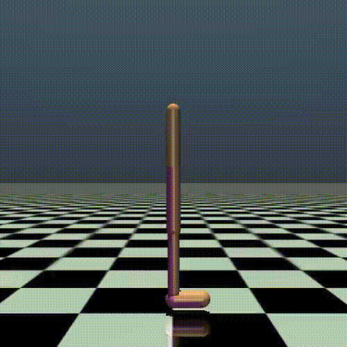 | 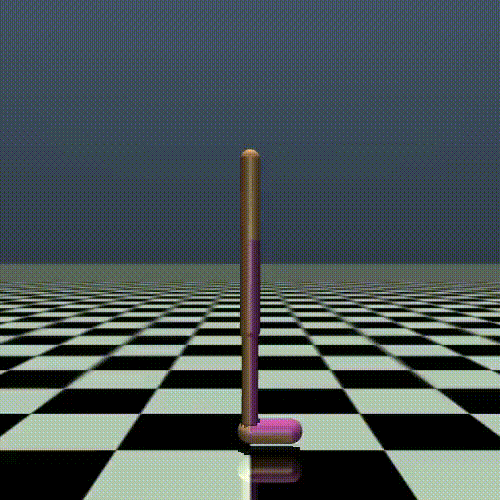

**Gravitational inference whilst invariant to mass**.
Under **GalilAI**, agents learn to discern between high and low gravitational environments - while being invariant to their own mass - through a free-falling behavior. This action mimics Galileo's experiments that ultimately let to the experimental discovery of the [Equivalence Principle](https://en.wikipedia.org/wiki/Equivalence_principle).

&nbsp;

| Windless | Windy |
| ------------------- | ----------------- |
| 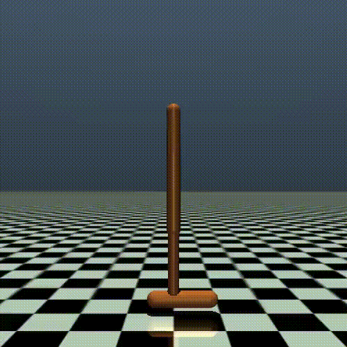 |  |
| 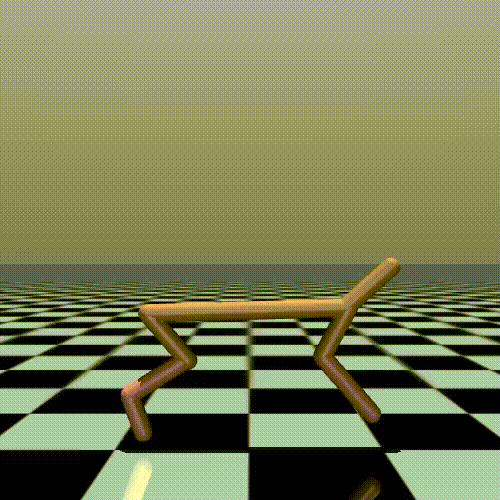 |  |
| 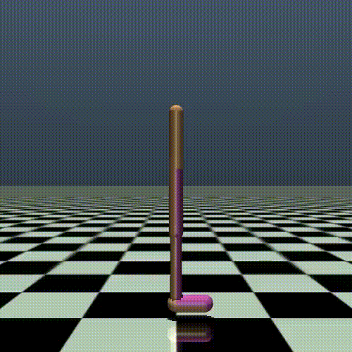 | |

**Wind perception whilst invariant to mass**.
When wind was added to their environments at test-time, agents learned to use their bodies as sails, as well as perform front-flips and rolls in the direction of the wind, to see how far the wind carried them along.

&nbsp;

| Low Mass | High Mass |
| ------------ | ------------- |
| 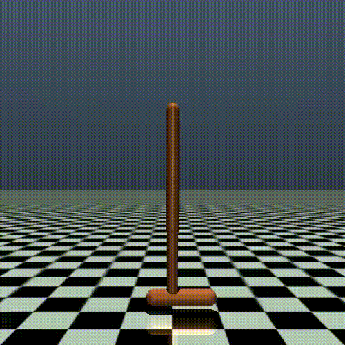 | 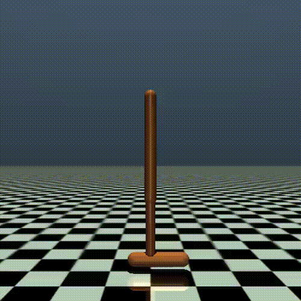 |
|  |  |
| 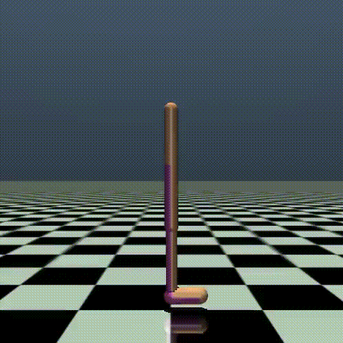 | 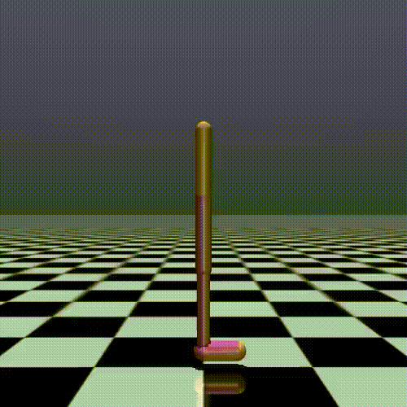 |

**Mass detection invariant to friction**.
Discerning between environment friction coefficient (training causal factor) and agent body mass (test causal factor) is a non-trivial task, as any horizontal motions are influenced by both. **GalilAI** overcomes this, by performing actions such as handstands allow the agent to correctly classify itself as heavy or light, while minimizing horizontal frictional forces that could lead to causal confusion.

&nbsp;

| Low Mass | High Mass |
| ------------ | ------------- |
|  | 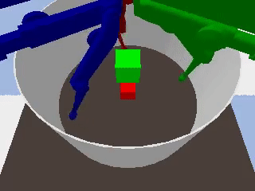

__Differentiating mass regardless of size__.
In  the Causal  World  environment\*, 
through light touch, agents learned an action sequence that would indeed push light blocks across the stage, but would not be forceful enough to push heavy blocks around.

\*_Note:_ The green block is an artifact of the Causal World environment; the agent is not able to see or interact with it. The agent is concerned with the red block only. 

&nbsp;

| Normal Framerate | Compromised Framerate |
| ----------------------- | ---------------------------- |
| 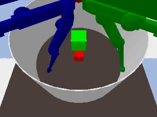 | 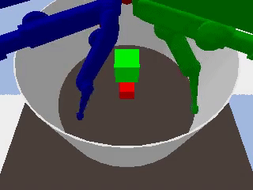 |

**Perception Frequency**.
Our agents were able to succesfully navigate their environments despite compromised sensor and control framerate settings. Interestingly, the agents learnt an action sequence that would successfully push a block around under compromised settings, but would not under normal settings.
